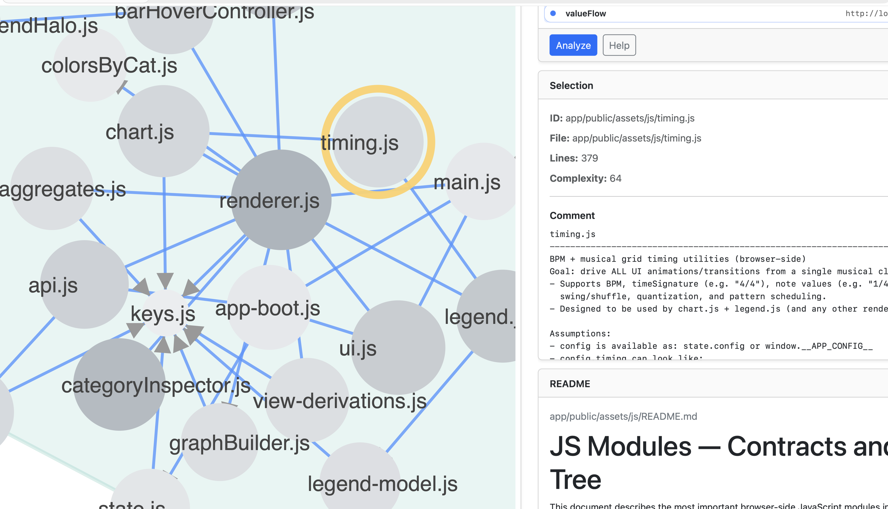

# NodeAnalyzer

Interactive Architecture & Dependency Visualization for Complex JavaScript & TypeScript Systems


## Why

Large and long-lived codebases tend to lose architectural transparency over time.  
Dependencies grow implicitly, complexity increases, and structural risks remain hidden.

NodeAnalyzer makes architecture visible again — supporting informed technical decision-making, refactoring strategy, and risk assessment.



---

## Value Proposition

NodeAnalyzer helps technical leaders and teams:

- Understand real dependency structures instead of assumed ones
- Detect architectural hotspots and complexity clusters
- Make refactoring decisions based on structural data
- Reduce onboarding time for new developers
- Create a shared architectural understanding across teams

---


## Example Use Case (CTO / Tech Lead Perspective)

**Scenario:**  
A product team plans a major feature extension in a 4+ year old codebase. Delivery pressure is high, but architectural side effects are unclear.

**Questions typically raised:**

- Which modules are central and highly coupled?
- Where are complexity hotspots that may slow down development?
- Which parts of the system are safe to modify?
- How will this change affect cross-team ownership boundaries?

**How NodeAnalyzer supports the decision:**

- Visualizes real dependency structures instead of assumed ones
- Highlights structural hotspots before changes are implemented
- Provides measurable complexity indicators (LOC, basic metrics)
- Creates a shared architectural view for technical discussions

Result: architectural decisions are based on structural data, not intuition.


<details>
<summary><strong>Purpose: </strong><br>Helps teams - <strong> evaluate architectural structure, detect structural risks and understand dependency complexity in existing codebases.</strong></summary>


AST-based (Babel) static analysis engine for JavaScript and TypeScript systems, designed for engineering teams who require architectural clarity:

- Architectural transparency
- Shared system understanding
- Documentation support
- Structural risk visibility

The tool focuses on **static structure**, not runtime behavior. It supports:

- Onboarding
- Refactoring decisions
- Risk analysis
- Technical debt visibility
- Cross-team understanding

It does not replace documentation — it *supports* it by exposing structural reality.

</details>

---

<details>
<summary><strong>Features: </strong><br>Automated structural analysis, dependency graph generation, complexity metrics and architectural hotspot detection.</summary>

NodeAnalyzer analyzes JavaScript / TypeScript applications from their entrypoint and generates a D3-based interactive architecture graph containing:

- Project structure with Modules, Functions, File header comments
- Import / dependency relationships
- Heuristic asset detection (HTML, CSS, JSON, CSV, etc.), rendered README.md files (README discovery per folder)
- LOC and basic complexity metrics

Key capabilities:

- Automated dependency graph generation
- Structural complexity evaluation
- Identification of architectural hotspots
- Asset and documentation linkage
- JSON export for further processing or integration

The physical location of analyzed projects is irrelevant. Targets are defined centrally via configuration. 
Entrypoint: is detected automatically (e.g., `app/server.js`, `app/index.js`, etc.). 

</details>

---

<details>
<summary><strong>Output: </strong><br>Structured JSON file (tmp) for the current interactive graph.</summary>

```
app/public/output/code-structure.json
```

Example:

```json
{
  "meta": { "entry": "app/index.js" },
  "nodes": [...],
  "links": [...]
}
```

- **nodes** → files, functions, assets
- **links / edges** → dependency relationships

</details>

---


## Tech Stack

- Node.js
- Express
- D3.js (Graph Rendering)
- JSON-based architecture model


## Architecture

NodeAnalyzer follows a layered architecture:

- Static analysis module
- Graph transformation layer
- Interactive visualization layer
- JSON export service

<details>
<summary><strong>Projects Configuration: </strong><br>app/config/apps.json.</summary>

Each target contains:

- `id`
- `name`
- `rootDir`
- `url` (optional)

apps.json may reside locally or on a shared team location.

</details>

---

<details>
<summary><strong>Installation</strong><br>Local setup for analysis and visualization.</summary>

Requirements:

- Node.js (>= 18 recommended)
- npm

Install dependencies once:

```bash
npm install
```

Start the server locally:

```bash
node app/server.js
```

Open in browser:

```
http://localhost:3003
```

</details>