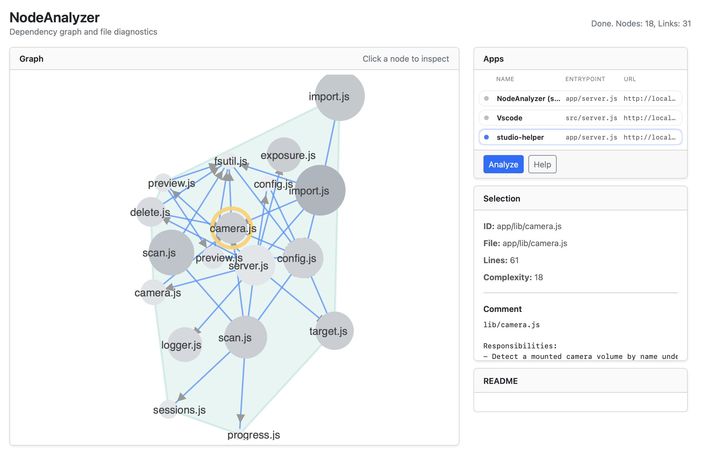

# NodeAnalyzer

*js-dependency-graph* node app for interactive static analysis of JS/Typescript web-apps (using dependency graphs for navigation).

## Features


- Entrypoint-based dependency graph
- LOC + heuristic complexity


## What it does

- Parses JavaScript / TypeScript source code
- Uses static analysis (AST-based, Babel)
- Builds dependency graphs
- Extracts file-level metrics and documentation
- Visualizes architecture & structure (not runtime behavior)

## Run
```bash
npm install
node app/server.js
```
## Tec

public/assets/metrics/code-structure.json

```json
{ "nodes": [ ... ], "links": [ ... ] }
```

will be rendered by d3.js


## Future
- external package nodes (`package:express`)
- tsconfig path alias resolution

# NodeAnalyzer

NodeAnalyzer ist ein AST-basierter Architektur- und Struktur-Analyzer für JavaScript- und TypeScript-Webanwendungen.

Die Anwendung erzeugt aus einem definierten Einstiegspunkt (Entrypoint) einen interaktiven Abhängigkeitsgraphen und visualisiert Projektstruktur, Module, Funktionen und relevante Assets.

---

## Aktueller Funktionsumfang

- Entrypoint-basierte Analyse (kein Full-Scan nötig)
- AST-Parsing mit Babel
- Datei- und Funktionsknoten im Graph
- Import-/Include-Beziehungen
- Heuristische Erkennung von Assets (HTML, CSS, JSON, CSV etc.)
- Auto-Modus für Single-File-Apps
- Erweiterte Verzeichnis-Expansion (z. B. public/, config/, data/)
- LOC- und einfache Komplexitätsmetriken
- D3-basierte interaktive Visualisierung

Ziel ist die Visualisierung der **Architektur**, nicht des Laufzeitverhaltens.

---

## Start

```bash
npm install
node app/server.js
```

Anschließend im Browser öffnen (Standard: http://localhost:3003).

---

## Output

Die Analyse erzeugt eine strukturierte JSON-Datei:

```
app/public/output/code-structure.json
```

Format:

```json
{
  "nodes": [...],
  "links": [...]
}
```

Diese wird automatisch mit D3 gerendert.

---

## Perspektive

- Externe Package-Nodes (z. B. `package:express`)
- Verbesserte Heuristiken für Asset- und Konfigurations-Erkennung
- Erweiterte Funktions- und Call-Graph-Analyse