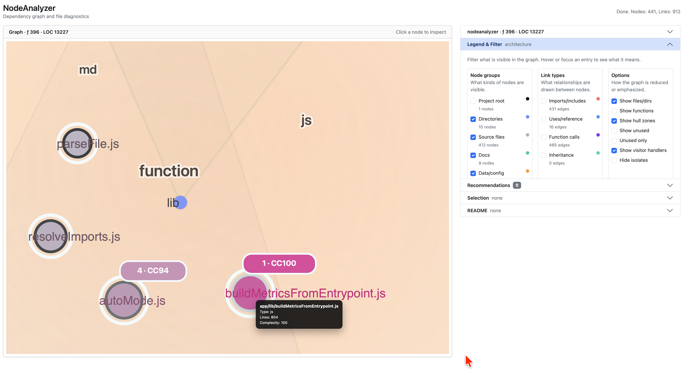

# NodeAnalyzer makes app architecture visible.

You really own *undocumented apps or websites* ? **Big risk — even if all works.**



---

<details>
<summary><strong>Purpose: </strong><br>Team decision helper - <strong>is our app XYZ on the right track ?</strong></summary>

AST-based (Babel) static analyzer for JavaScript and TypeScript apps, designed for developers and teams who need:

- Architectural transparency
- Shared system understanding
- Documentation support
- Structural risk visibility

The tool focuses on **structure**, not runtime behavior and *supports*:

- Onboarding
- Refactoring decisions
- Risk analysis
- Technical debt visibility
- Cross-team understanding

It does not replace documentation — it *supports* it by exposing structural reality.

</details>

---

<details>
<summary><strong>Features: </strong><br>Automatic detection of structure, dependencies, complexity, assets, existing documentation. Butterfly the project code.</summary>

NodeAnalyzer analyzes JavaScript / TypeScript applications starting from their entrypoint and generates an D3-based interactive  architecture graph containing:

- Project structure with Modules, Functions, File header comments
- Import / dependency relationships
- Heuristic asset detection (HTML, CSS, JSON, CSV, etc.), rendered README.md files (README discovery per folder)
- LOC and basic complexity metrics

The physical location of analyzed projects is irrelevant. Targets are defined centrally via configuration.


</details>

---

<details>
<summary><strong>Output: </strong><br>Structured JSON file (tmp) for the current interactive graph.</summary>

```
app/public/output/code-structure.json
```

Example:

```json
{
  "meta": { "entry": "app/index.js" },
  "nodes": [...],
  "links": [...]
}
```

- **nodes** → files, functions, assets
- **links / edges** → dependency relationships

</details>

---

<details>
<summary><strong>Projects Configuration: </strong><br>app/config/apps.json.</summary>

Each target contains:

- `id`
- `name`
- `rootDir`
- `url` (optional)

The entrypoint is detected automatically (e.g., `app/server.js`, `app/index.js`, etc.).

The configuration may reside locally or on a shared team location.

</details>

---

<details>
<summary><strong>Kickoff using node ... </strong><br>start the app and use it in the browser.</summary>

Install dependencies once:

```bash
npm install
```

Start the server:

```bash
node app/server.js
```

Open in browser:

```
http://localhost:3003
```

</details>